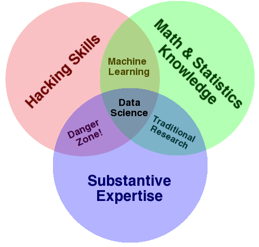

---
jupyter:
  jupytext:
    formats: ipynb,md
    text_representation:
      extension: .md
      format_name: markdown
      format_version: '1.3'
      jupytext_version: 1.19.1
  kernelspec:
    display_name: Python 3 (ipykernel)
    language: python
    name: python3
---

# Preface


## 什么是数据科学？

这是一本关于使用Python进行数据科学的书，这立即引出了一个问题：什么是*数据科学*？

这个定义出乎意料地难以明确，尤其考虑到这一术语已经变得如此普遍。

一些直言不讳的批评者将其视为多余的标签（毕竟，哪门科学不涉及数据呢？）或仅仅是一个流行词，只存在于简历中，以吸引过于热衷的技术招聘人员的注意。

在我看来，这些批评忽略了一些重要内容。

尽管有许多炒作，但数据科学也许是我们对跨学科技能集合最好的称谓，而这些技能在工业和学术界中的许多应用中正变得越来越重要。

这个*跨学科*的特性至关重要：在我看来，现有的数据科学最佳定义由Drew Conway的数据科学维恩图所示，该图首次发表于他2010年9月的博客上（见下图）。




<small>(source: [Drew Conway](http://drewconway.com/zia/2013/3/26/the-data-science-venn-diagram), used by permission)</small>


虽然一些交集标签有些调侃，但这个图表捕捉了我认为人们所说的“数据科学”的本质：它从根本上是一个跨学科的主题。

数据科学包括三个不同但重叠的领域：一是*统计学家*的技能，他们知道如何对不断增长的数据集进行建模和总结；二是*计算机科学家*的技能，他们能够设计和使用算法来高效地存储、处理和可视化这些数据；三是*领域专业知识*——我们可以将其视为在某一学科中的“经典”培训——这对于提出正确的问题以及将答案置于上下文中都是必要的。

考虑到这一点，我鼓励你把数据科学看作不是一个需要学习的新知识领域，而是一套可以应用于你当前专业领域的新技能。

无论你是在报告选举结果、预测股票收益、优化在线广告点击、识别显微镜照片中的微生物，还是寻找新的天文学对象类别，或者在任何其他领域工作，本书的目标是让你具备提出并回答关于所选主题的新问题的能力。


## 本书适合谁？

在我于华盛顿大学以及各种技术聚焦的会议和交流会上授课时，我听到的最常见问题之一是：“我应该如何学习Python？”

提问者通常是具有技术背景的学生、开发者或研究人员，他们往往已经具备编写代码和使用计算及数值工具的扎实基础。

这些人并不单纯想要学习Python，而是希望掌握这门语言，以便将其作为数据密集型和计算科学的工具。

虽然网上有大量针对这一受众的视频、博客文章和教程，但我一直对缺乏一个明确且有效答案感到沮丧，这也是促使我撰写本书的原因。

本书并不是为了介绍Python或编程的一般概念；我假设读者对Python语言已有一定了解，包括定义函数、赋值变量、调用对象的方法、控制程序流程以及其他基本任务。

相反，本书旨在帮助Python用户学习如何使用Python的数据科学栈——包括以下部分提到的库及相关工具——以有效地存储、处理数据，并从中获取洞察。


## 为什么选择Python？

Python在过去几十年中已经成为科学计算任务的一流工具，包括大数据集的分析和可视化。

这可能让Python语言的早期支持者感到惊讶：这种语言本身并不是专门为数据分析或科学计算而设计的。

Python在数据科学中的实用性主要源于庞大的活跃的第三方包生态系统：*NumPy*用于操作基于数组的同质数据，*Pandas*用于操作异质和标记数据，*SciPy*用于常见的科学计算任务，*Matplotlib*用于出版物质量的可视化，*IPython*用于代码的交互式执行和共享，*Scikit-Learn*用于机器学习，以及将在以下页面中提到的许多其他工具。

如果您正在寻找Python语言的指南，我建议参考这本书的姊妹项目，[https://www.oreilly.com/library/view/a-whirlwind-tour/9781492037859](_Python语言快速入门_)。

这份简短报告提供了Python语言的基本功能之旅，旨在针对已经熟悉一种或多种其他编程语言的数据科学家。


## 书籍大纲

本书的每个编号部分聚焦于一个特定的软件包或工具，这些软件包或工具为Python数据科学故事提供了基本组成部分，并分解为短小且独立的章节，每章讨论一个单一概念：

- *第一部分，Jupyter：超越普通Python*，介绍了IPython和Jupyter。这些软件包提供了许多使用Python的数据科学家工作的计算环境。

- *第二部分，NumPy简介*，重点介绍NumPy库，该库提供`ndarray`用于高效存储和操作Python中的密集数据数组。

- *第三部分，使用Pandas进行数据处理*，介绍Pandas库，该库提供`DataFrame`用于高效存储和操作带标签/列式的数据。

- *第四部分，与Matplotlib可视化*，集中讲解Matplotlib，这是一个在Python中提供灵活范围的数据可视化能力的库。

- *第五部分，机器学习*，专注于Scikit-Learn库，该库为最重要和成熟的机器学习算法提供高效、简洁的Python实现。

PyData世界显然远比这六个软件包要广阔得多，并且每天都在不断发展壮大。

考虑到这一点，我在本书中尽力引用其他有趣的努力、项目和软件包，它们正在推动Python所能做事情的边界。

尽管如此，我所关注关注的软件包目前对很多在Python数据科学领域开展的工作至关重要，我预计即使生态系统继续围绕它们增长，它们仍将保持重要性。


## 使用代码示例

补充材料（代码示例、图形等）可在 http://github.com/jakevdp/PythonDataScienceHandbook/ 下载。本书旨在帮助您完成工作。一般而言，如果本书提供了示例代码，您可以在您的程序和文档中使用它。除非您要复制大量的代码，否则无需联系我们获取许可。例如，编写一个使用本书多个代码块的程序不需要获得许可。而销售或分发 O'Reilly 书籍中的示例 CD-ROM 则需要获得许可。引用本书并引用示例代码来回答问题不需要许可。然而，将本书中的大量示例代码纳入您的产品文档则需要获得许可。

我们感谢但不要求署名。署名通常包括标题、作者、出版社和 ISBN。例如：“*Python Data Science Handbook*, 第二版, 作者：Jake VanderPlas (O’Reilly)。版权 © 2023 Jake VanderPlas, ISBN 978-1-098-12122-8。”

如果您认为您的使用超出了合理使用或上述授权，请随时通过 permissions@oreilly.com 联系我们。


## 安装注意事项

安装Python及其科学计算库非常简单。本节将概述在设置计算机时需要考虑的一些事项。

虽然有多种方式可以安装Python，但我建议用于数据科学的版本是Anaconda发行版，无论您使用Windows、Linux还是macOS，它的工作方式都相似。

Anaconda发行版有两种选择：

- [Miniconda](http://conda.pydata.org/miniconda.html) 提供了Python解释器以及一个名为*conda*的命令行工具，该工具作为跨平台的软件包管理器，专注于Python软件包，其精神类似于Linux用户熟悉的apt或yum工具。

- [Anaconda](https://www.continuum.io/downloads) 包含了Python和conda，并额外捆绑了一套针对科学计算预先安装的软件包。由于这个捆绑包的大小，请预计安装将占用几个GB的磁盘空间。

任何包含在Anaconda中的软件包也可以手动在Miniconda上进行安装；因此，我建议从Miniconda开始。

要开始，请下载并安装Miniconda软件包——确保选择带有Python 3的版本——然后安装本书中使用的核心软件包：

```
[~]$ conda install numpy pandas scikit-learn matplotlib seaborn jupyter
```

在整个文本中，我们还会使用其他更专业的工具，这些工具属于Python科学生态系统；通常通常只需输入 **`conda install packagename`** 即可轻松完成安装。

如果您遇到默认conda频道中没有的软件包，请务必查看[*conda-forge*](https://conda-forge.org/)，这是一个广泛且由社区驱动的conda软件包仓库。

有关更多关于conda的信息，包括创建和使用conda环境（我强烈推荐）的信息，请参考[conda在线文档](http://conda.pydata.org/docs/)。

```python

```
