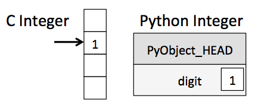
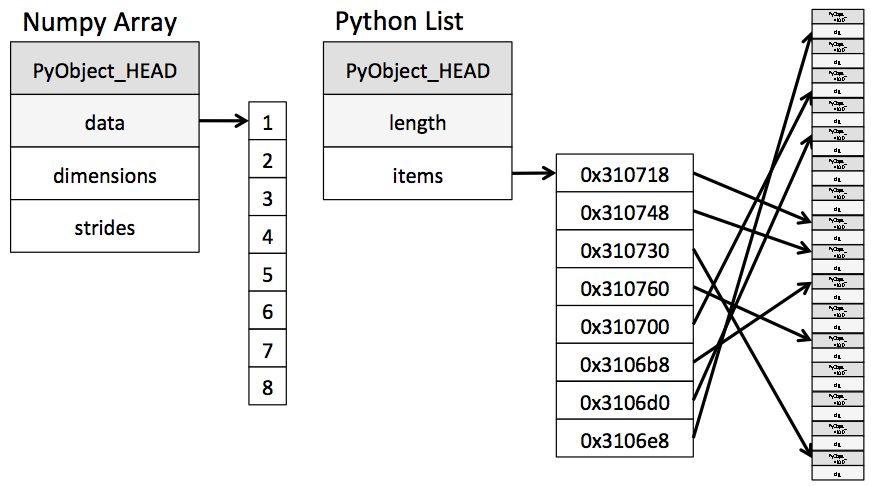

---
jupyter:
  jupytext:
    formats: ipynb,md
    text_representation:
      extension: .md
      format_name: markdown
      format_version: '1.3'
      jupytext_version: 1.19.1
  kernelspec:
    display_name: Python 3 (ipykernel)
    language: python
    name: python3
---

# 理解Python中的数据类型


<!-- #region -->
有效的数据驱动科学与计算需要理解数据是如何存储和操作的。

本章概述并对比了Python语言中数组数据的处理方式，以及NumPy对此的改进。

理解这一差异对于掌握本书其余部分的大量内容至关重要。

Python用户通常被其易用性所吸引，其中一个原因就是动态类型。

静态类型语言如C或Java要求每个变量必须明确声明，而动态类型语言如Python则跳过了这一规范。例如，在C中，您可能会这样指定特定操作：

```C
/* C代码 */

int result = 0;

for(int i=0; i<100; i++){
    result += i;
}
```

而在Python中，相应的操作可以写成这样：

```python
# Python代码

result = 0

for i in range(100):
    result += i
```

注意一个主要区别：在C中，每个变量的数据类型都是显式声明的，而在Python中，类型是动态推断的。这意味着，例如，我们可以将任何种类的数据赋值给任何变量：

```python
# Python代码

x = 4

x = "four"
```

这里我们将`x`的内容从整数切换为字符串。在C中，这样做会导致（根据编译器设置）编译错误或其他意外后果：

```C
/* C代码 */

int x = 4;

x = "fourfour"; // 编译失败
```

这种灵活性使得Python及其他动态类型语言变得方便且易于使用。

理解*这如何运作*是学习高效、有效地使用Python分析数据的重要组成部分。

但这种类型灵活性还表明，Python变量不仅仅包含它们的值；它们还包含关于值*类型*的额外信息。我们将在接下来的章节中进一步探讨这个问题。
<!-- #endregion -->

## Python整数不仅仅是一个整数

标准的Python实现是用C语言编写的。

这意味着每个Python对象实际上都是一个巧妙伪装的C结构，它不仅包含其值，还包含其他信息。例如，当我们在Python中定义一个整数，如`x = 10000`时，`x`并不只是一个“原始”整数。它实际上是指向一个复合C结构的指针，该结构包含多个值。

通过查看Python 3.10源代码，我们发现整数（长整型）类型定义有效地看起来像这样（展开C宏后）：

```C
struct _longobject {
    long ob_refcnt;
    PyTypeObject *ob_type;
    size_t ob_size;
    long ob_digit[1];
};
```

在Python 3.10中，一个单一的整数实际上包含四个部分：

- `ob_refcnt`：引用计数，帮助Python静默处理内存分配和释放

- `ob_type`：编码变量类型的信息

- `ob_size`：指定后续数据成员的大小

- `ob_digit`：包含我们期望该Python变量表示的实际整数值

这意味着，与像C这样的编译语言相比，在Python中存储一个整数会涉及一些开销，如下图所示。





这里，`PyObject_HEAD` 是结构的一部分，包含引用计数、类型代码以及之前提到的其他信息。

请注意这里的区别：C 整数本质上是内存中一个位置的标签，其字节编码了一个整数值。

Python 整数是指向内存中某个位置的指针，该位置包含所有 Python 对象的信息，包括表示整数值的字节。

Python 整数结构中的这些额外信息使得 Python 的编程变得如此自由和动态。

然而，这些在 Python 类型中的附加信息是有代价的，这一点在结合许多此类对象的结构中特别明显。


## Python 列表不仅仅是一个列表

现在让我们考虑一下，当我们使用一种可以容纳多个 Python 对象的 Python 数据结构时，会发生什么。

在 Python 中，标准的可变多元素容器是列表。

我们可以按如下方式创建一个整数列表：

```python jupyter={"outputs_hidden": false}
L = list(range(10))
L
```

```python jupyter={"outputs_hidden": false}
type(L[0])
```

或者，类似地，一个字符串列表：

```python jupyter={"outputs_hidden": false}
L2 = [str(c) for c in L]
L2
```

```python jupyter={"outputs_hidden": false}
type(L2[0])
```

由于Python的动态类型特性，我们甚至可以创建异构列表：

```python jupyter={"outputs_hidden": false}
L3 = [True, "2", 3.0, 4]
[type(item) for item in L3]
```

但这种灵活性是有代价的：为了允许这些灵活类型，列表中的每个项必须包含其自身的类型、引用计数和其他信息。也就是说，每个项都是一个完整的Python对象。

在所有变量都属于同一类型的特殊情况下，这些信息大部分是冗余的，因此将数据存储在固定类型数组中会更加高效。

动态类型列表与固定类型（NumPy风格）数组之间的区别如以下图所示：





在实现层面，数组本质上包含一个指向连续数据块的单一指针。

而Python列表则包含一个指向指针块的指针，每个指针又分别指向完整的Python对象，例如我们之前看到的Python整数。

再次强调，列表的优势在于灵活性：因为每个列表元素都是一个包含数据和类型信息的完整结构，所以该列表可以填充任何所需类型的数据。

固定类型的NumPy风格数组缺乏这种灵活性，但在存储和操作数据方面更为高效。


## Python中的固定类型数组

Python提供了几种不同的选项，用于在高效的固定类型数据缓冲区中存储数据。

内置的`array`模块（自Python 3.3起可用）可以用于创建统一类型的密集数组。

```python jupyter={"outputs_hidden": false}
import array
L = list(range(10))
A = array.array('i', L)
A
```

在这里，`'i'` 是一个类型代码，表示内容为整数。

然而，更有用的是 NumPy 包的 `ndarray` 对象。

虽然 Python 的 `array` 对象提供了高效的数组数据存储，但 NumPy 在此基础上增加了对这些数据的高效 *操作*。

我们将在后面的章节中探讨这些操作；接下来，我将向您展示几种创建 NumPy 数组的方法。


## 从Python列表创建数组

我们将从标准的NumPy导入开始，使用别名`np`：

```python
import numpy as np
```

现在我们可以使用 `np.array` 从 Python 列表创建数组：

```python jupyter={"outputs_hidden": false}
# Integer array
np.array([1, 4, 2, 5, 3])
```

请记住，与Python列表不同，NumPy数组只能包含相同类型的数据。

如果数据类型不匹配，NumPy将根据其类型提升规则进行向上转换；在这里，整数会被提升为浮点数。

```python jupyter={"outputs_hidden": false}
np.array([3.14, 4, 2, 3])
```

如果我们想明确设置结果数组的数据类型，可以使用 `dtype` 关键字：

```python jupyter={"outputs_hidden": false}
np.array([1, 2, 3, 4], dtype=np.float32)
```

最终，与始终是一维序列的Python列表不同，NumPy数组可以是多维的。以下是使用列表的列表初始化多维数组的一种方法：

```python jupyter={"outputs_hidden": false}
# Nested lists result in multidimensional arrays
np.array([range(i, i + 3) for i in [2, 4, 6]])
```

内部列表被视为生成的二维数组的行。


## 从头创建数组

对于较大的数组，使用NumPy内置的例程从头创建数组更为高效。

以下是几个示例：

```python jupyter={"outputs_hidden": false}
# Create a length-10 integer array filled with 0s
np.zeros(10, dtype=int)
```

```python jupyter={"outputs_hidden": false}
# Create a 3x5 floating-point array filled with 1s
np.ones((3, 5), dtype=float)
```

```python jupyter={"outputs_hidden": false}
# Create a 3x5 array filled with 3.14
np.full((3, 5), 3.14)
```

```python jupyter={"outputs_hidden": false}
# Create an array filled with a linear sequence
# starting at 0, ending at 20, stepping by 2
# (this is similar to the built-in range function)
np.arange(0, 20, 2)
```

```python jupyter={"outputs_hidden": false}
# Create an array of five values evenly spaced between 0 and 1
np.linspace(0, 1, 5)
```

```python jupyter={"outputs_hidden": false}
# Create a 3x3 array of uniformly distributed
# pseudorandom values between 0 and 1
np.random.random((3, 3))
```

```python jupyter={"outputs_hidden": false}
# Create a 3x3 array of normally distributed pseudorandom
# values with mean 0 and standard deviation 1
np.random.normal(0, 1, (3, 3))
```

```python jupyter={"outputs_hidden": false}
# Create a 3x3 array of pseudorandom integers in the interval [0, 10)
np.random.randint(0, 10, (3, 3))
```

```python jupyter={"outputs_hidden": false}
# Create a 3x3 identity matrix
np.eye(3)
```

```python jupyter={"outputs_hidden": false}
# Create an uninitialized array of three integers; the values will be
# whatever happens to already exist at that memory location
np.empty(3)
```

<!-- #region -->
## NumPy标准数据类型

NumPy数组包含单一类型的值，因此了解这些类型及其限制非常重要。

由于NumPy是用C语言构建的，这些类型对于C、Fortran和其他相关语言的用户来说将是熟悉的。

标准NumPy数据类型列在下表中。

请注意，在构造数组时，可以使用字符串指定它们：

```python
np.zeros(10, dtype='int16')
```

或者使用相应的NumPy对象：

```python
np.zeros(10, dtype=np.int16)
```
<!-- #endregion -->

| Data type	 | Description |
|-------------|-------------|
| `bool_`     | Boolean (True or False) stored as a byte |
| `int_`      | Default integer type (same as C `long`; normally either `int64` or `int32`)| 
| `intc`      | Identical to C `int` (normally `int32` or `int64`)| 
| `intp`      | Integer used for indexing (same as C `ssize_t`; normally either `int32` or `int64`)| 
| `int8`      | Byte (–128 to 127)| 
| `int16`     | Integer (–32768 to 32767)|
| `int32`     | Integer (–2147483648 to 2147483647)|
| `int64`     | Integer (–9223372036854775808 to 9223372036854775807)| 
| `uint8`     | Unsigned integer (0 to 255)| 
| `uint16`    | Unsigned integer (0 to 65535)| 
| `uint32`    | Unsigned integer (0 to 4294967295)| 
| `uint64`    | Unsigned integer (0 to 18446744073709551615)| 
| `float_`    | Shorthand for `float64`| 
| `float16`   | Half-precision float: sign bit, 5 bits exponent, 10 bits mantissa| 
| `float32`   | Single-precision float: sign bit, 8 bits exponent, 23 bits mantissa| 
| `float64`   | Double-precision float: sign bit, 11 bits exponent, 52 bits mantissa| 
| `complex_`  | Shorthand for `complex128`| 
| `complex64` | Complex number, represented by two 32-bit floats| 
| `complex128`| Complex number, represented by two 64-bit floats| 


More advanced type specification is possible, such as specifying big- or little-endian numbers; for more information, refer to the [NumPy documentation](http://numpy.org/).
NumPy also supports compound data types, which will be covered in [Structured Data: NumPy's Structured Arrays](02.09-Structured-Data-NumPy.ipynb).

```python

```
